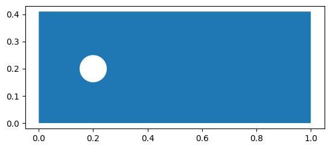
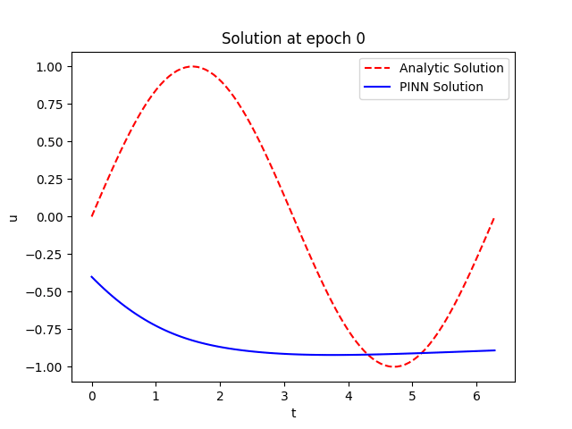

# Torch DE

Torch_DE is a framework for solving differential equations (DE) using Physics Infomed Neural Networks (PINNs)! 

Torch_DE's approach is to be highly modular between different components while still remaining close to standard pytorch syntax allowing easy modification to the runnning code. While PINN frameworks like Modulus and DeepXDE are very powerful,it can be difficult to understand the backend and make changes to the training loop.

The advantage of sticking to pytorch syntax is users can freely choose what parts about torch DE are useful and more easily combine them into their workflow. For example, because torch DE sticks to pytroch syntax, incorporating workflows such as tensorboard or WanDb is significantly easier. You can also reduce boilerplate via Pytorch Lightning!


# Aim
Torch DE is currently focused on the creation of PINNs on 2D spatial geometries (with optional time dimension). 2D geometries is the focus as it can easily be visualised on a notebook or pyplot, while also having geometric complexity that 1D problems lack.  

Currently implementing the features found in [JaxPI](https://github.com/PredictiveIntelligenceLab/jaxpi)! Check them out!

# TLDR Features
- Easy Derivative and residual calculation
    - Automatic Diff and Finite Differences
- Geometry creation, point generation, signed distance function
- Network Implementations ([RWF](https://arxiv.org/abs/2210.01274) and [Random Fourier Features](https://arxiv.org/abs/2006.10739))
- Sampling techniques via [R3 Sampling](https://arxiv.org/abs/2207.02338)
- Automatic weighting via [Learning Rate Annealing/Gradient Normalisation](https://epubs.siam.org/doi/10.1137/20M1318043) 
- Visualisation of results

# Installation
Currently to use torch DE clone the repository:

```bash
git clone https://github.com/JohnCSu/torch_DE.git
cd torch_DE
# Install Requirements
python3 -m pip install -r .
# Add to python path
python3 -m pip install -e .
```

A packaged version will be available in the future once I get things up to standard!

# Components
## Geometry
torch DE geometry is allows you to create simple 2D domains for training PINNs. We pick 2D as it can easily be displayed in a notebook compared to 3D (and 1D is just a line!):

```python
from torch_DE.geometry.shapes import Circle,Rectangle,Domain2D
(xmin,xmax),(ymin,ymax) = (0,1), (0,0.41)
domain = Rectangle(((xmin,ymin),(xmax,ymax) ),'corners')
domain = Domain2D(base = domain)

hole = Circle((0.2,0.2),r = 0.05,num_points= 512)
domain.remove(hole,names= ['Cylinder'])

domain.plot()
```



## Defining Derivatives
torch DE uses letter strings for defining input and output values:
```python
input_vars = ['x','t']
output_vars =['u']
```
Only single letter variables names are currently supported. For derivatives we use the subscript notation e.g $u_x$ to define derivatives:
```python
derivatives = ['u_x','u_xx','u_xy']
```
- `u_x` is $u_x = \frac{\partial u}{\partial x}$
- `u_xx` is $u_{xx} = \frac{\partial^2 u}{\partial x^2}$
- `u_xy` is $u_{xy} = \frac{\partial^2 u}{\partial xy}$

And so on!

## Continuous
torch DE currently operates on the classic continious mesh-free PINN by [Raissi et al](https://maziarraissi.github.io/PINNs/). At the heart of this project is the `DE_getter` object which turns extracting derivatives from networks from a indexing to dictionary strings! Give  `DE_getter` a network, input, output variables and the derivatives you want and it will do the rest! Here's a simple 1D Spring example:

```python
import torch
import torch.nn as nn
from torch_DE.continuous import DE_Getter

# Solving the Spring Equation u_tt = -u with u(0) = 0 and u_t(0) = 1

net = nn.Sequential(nn.Linear(1,200),nn.Tanh(),nn.Linear(200,1))
PINN = DE_Getter(net = net)
PINN.set_vars(input_vars= ['t'], output_vars= ['u'])
PINN.set_derivatives(derivatives=['u_t','u_tt'])
#Torch DE assumes first dimension is the batch dimension
t = torch.linspace(0,2*torch.pi,100).unsqueeze(dim =-1)

optimizer = torch.optim.Adam(params = net.parameters(), lr = 1e-3)
# Training Loop
for epoch in range(5000):
    #Calculate Derivatives
    out = PINN.calculate(t)
    #Output for DE_Getter is a dict of dictionaries containing tensors
    out = out['all']
    #Spring Equation is u_tt + u = 0
    residual = (out['u_tt'] + out['u']).pow(2).mean()

    #Data Fitting term
    data = out['u'][0].pow(2).mean() + (out['u_t'][0] - 1).pow(2).mean()

    loss = data + residual
    optimizer.zero_grad()
    loss.backward()
    optimizer.step()

```


Combined with the other components, PINN training gets much easier to maintain and more effecient. 


Currently, you can extract derivatives using autodiff or via finite differences!

## Backend
Torch_DE uses [`torch.func`](https://pytorch.org/docs/stable/func.html) module and vmap to extract derivatives so currently multi-gpu and models with buffers (such as batch norm) may not work as intended. Using has the advantages:

- Functorch obtains all the derivatives (i.e. the Jacobian) of a certain order all at once
- allows any derivative to be obtained
- No need to mess with torch.autograd which means:
    - seting input data's `requires_grad_ = True`
    - Setting `retain_graph =True` and/or `create_graph=True`

## Visualization
Plotting is always an annoying task so there is a lot of work currently being done in Torch DE on visualization. Stay tuned for updates!

# Licence
MIT